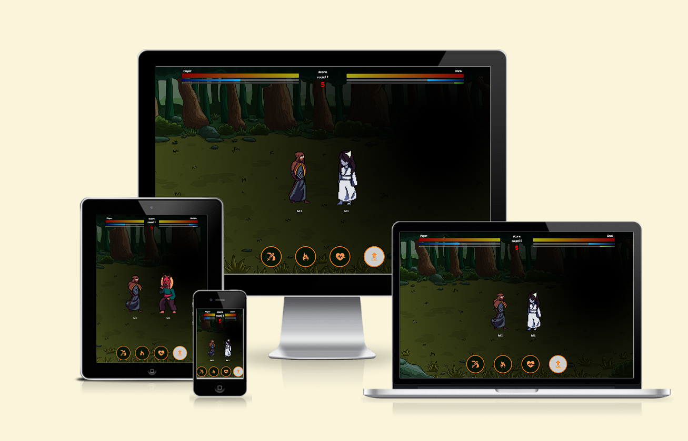
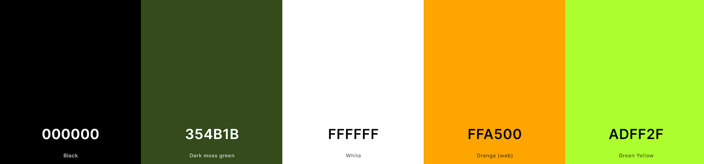
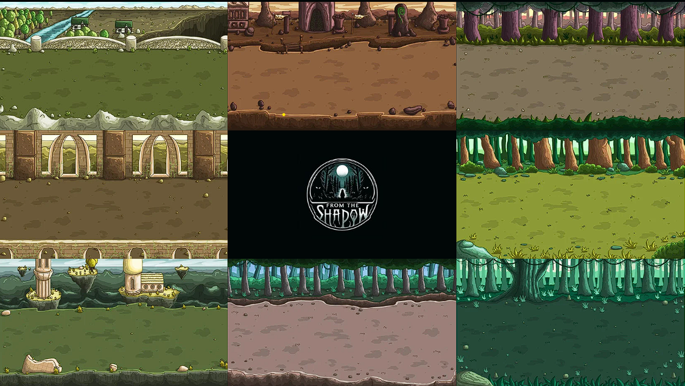
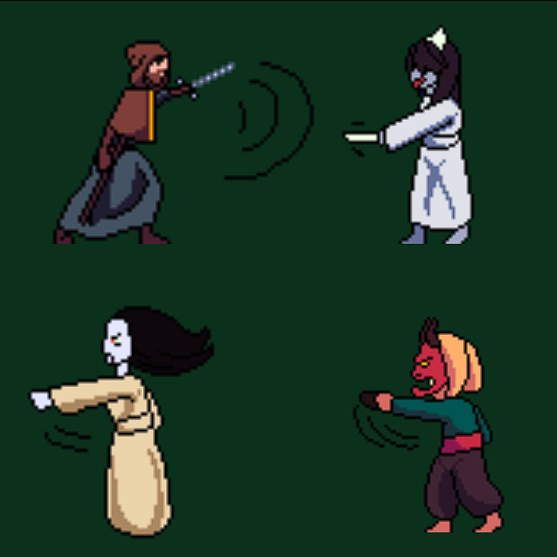
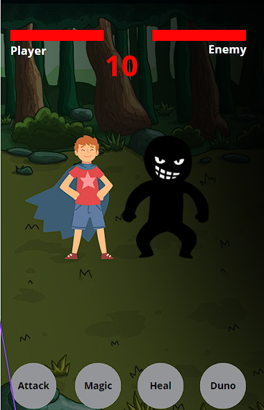
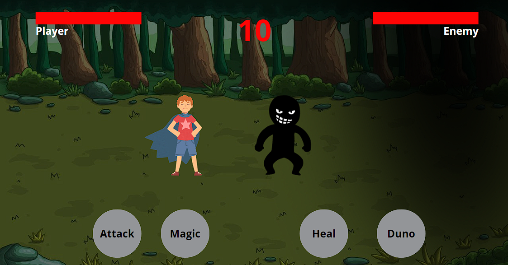
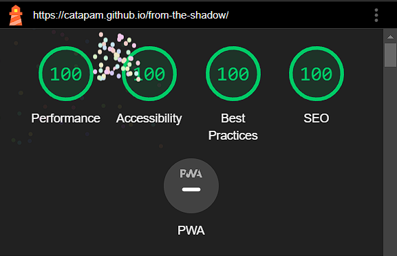
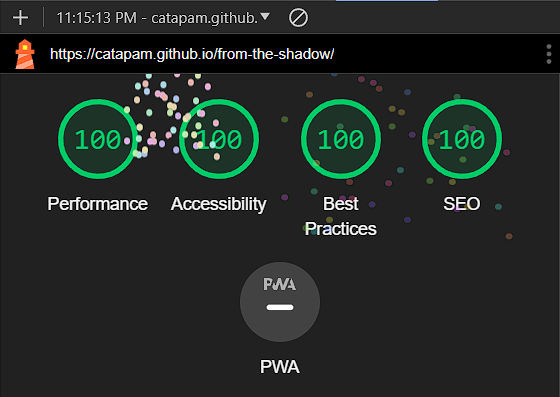

# From the shadow

[Live project can be viewed here](https://catapam.github.io/from-the-shadow)

Welcome to "From the Shadow," a thrilling medieval-themed turn-based RPG where you fight against demons emerging from a mysterious black shadow to save your village.

# Table of Contents

* [Description](#description)
* [User Experience](#user-experience)
* [Design](#design)
    * [Colors](#colors)
    * [Typography](#typography)
    * [Scenario](#scenario)
    * [Characters](#characters)
    * [Wireframes](#characters)
* [Features](#features)
    * [Existing features](#existing-features)
    * [Future features](#future-features)
* [How to play](#how-to-play)
* [Technology used](#technology-used)
    * [Language](#language)
    * [Frameworks, Libraries and Programs](#frameworks-libraries--programs)
* [Deployment](#deployment)
* [Testing](#testing)
    * [Manual testing](#manual-testing)
* [Credits](#credits)
    * [Code](#code)
    * [Content](#content)
* [Acknowledgements](#acknowledgements)

# Description

In "From the Shadow," the village is under siege by supernatural forces emanating from an enigmatic darkness. As a hero, you are tasked with defending the realm using your strategic skills in turn-based combat. With each round, face increasingly formidable demons, level up your character, and ensure the safety of your world.

# User Experience

From the Shadow is crafted to ensure a seamless and engaging user experience. Below are the key UX elements that have been integrated into the game to enhance playability and user satisfaction:

* Intuitive Interface: The game features an easy-to-navigate interface, with clear and accessible controls. Each button and control is intuitively placed to ensure a smooth gameplay experience without unnecessary complexity.

* Responsive Design: The game's design is responsive and optimized for various devices and screen sizes, ensuring that players can enjoy the game on desktops, tablets, and mobile devices, both portrait and landscape format with equal functionality and aesthetic appeal.

* Engaging Visuals: Employing a dark, medieval theme with vivid animations and detailed character designs, the game offers a visually stimulating experience. The use of high-quality animations and consistent graphic themes immerses players in a fantastical world.

* Adaptive Difficulty: As players progress, the game's difficulty adapts to provide a challenging yet achievable gameplay experience. This dynamic difficulty adjustment helps maintain engagement by providing a balanced challenge based on the player's performance.

* Interactive Tutorials and Help: New players can get up to speed quickly with interactive tutorials that explain gameplay mechanics clearly. These tutorials are easily accessible at any time, providing guidance just when the player needs it.

* Accessibility Features: Accessibility is a priority, with features like high contrast visual settings, text descriptions for all audio content, and keyboard navigability ensuring that players with different abilities can enjoy the game.

* Performance Optimization: The game is optimized for performance, with smooth frame rates and quick loading times on supported devices, ensuring that gameplay remains fluid and responsive.

By focusing on a user-centered design approach, From the Shadow aims to deliver a compelling and accessible game experience that meets the needs and expectations of a diverse player base.

# Design

* The design was inspired in late 90s technology, with pixelated characters and a static background;
* The game happens in medieval ages, and the main character is a wizzard;
* The enemies are unkown creatures, with exotic names reinforcing the little is known about them;
* All effects are small movements that give the impression of hitting the other player;
* The shadow is primarily round, but the shading cover the whole screen representing the evil coming from it, the shadow 'shines' pure darkness;
* Classic fight game bars are used to show Health, stamina/mana, and experience;
* The gameplay is inspired in RPG turn-by-turn games, where attack defence, stategy and luck are at play all at the same time;
* Difficulty increases as rounds and levels are going by;
* The hero is 'illuminated' and can be revived by a divine light that is seen also when the hero recharges health;
* The hero runs out of the screen to next round while the screen gets darker when an enemy is defeated, engaging the player to check what comes next;
* Next turn will bring new random enemies and backgrounds, enter in depth in the story and universe;

## Colors

* The thematic is medieval and dark, so colors chosen were Black and green for main background and logo elements.
* White texts to contrast with those dark colors
* Buttons are generally White in dialog screens, but orange on game controls to stand out from the screen as part of the game interaction
* Vivid green is used in tutorials to stand out which elements are being checked at the moment

## Typography 

* The font chosen had to be something gamy: Comic Sans MS

## Scenario

* The game can randomly send the player to one of the 8 background scenarios available 

## Characters

* At the moment there are 4 characters, 1 hero and 3 enemies:

## Wireframes

- Mobile:

- Desktop:

# Features

## Existing features

* Dynamic Combat System: Engage in turn-based battles where your strategic choices determine the outcome.
* Enemy AI: the next action the nemy will take can always suprise the player.
* Character Progression: Level up your hero with increased health, mana, and strength to face tougher enemies.
* Immersive Storyline: Dive into a dark, captivating narrative as you uncover the secrets behind the menacing shadow.
* Interactive Tutorials: Learn the mechanics of the game through interactive guides and modal dialogs.

## Future features

This could become a big game full of features, to list some:
* Ranking of highest scores locally
* Sound effects
* Boss levels
* Usable items, like potions for mana, food for health
* Collectionable items
* New selectable heros, with different powers
* New enemies
* New scenarios
* Network connection
* Paid content
* Community forum
* Microtransactions
* Multiplayer 

# How to play

* Starting the Game: Click the 'Start' button from the main menu to enter the game.
* Character Naming: Enter your hero's name to personalize your experience.
* Combat Mechanics: Use attack, magic, and special abilities to defeat enemies. Monitor your health, mana, and experience bars to manage your resources effectively.
* Advancing Levels: Gain experience from battles to level up your hero, improving your combat abilities and resource capacities.
* Pause/Resume: Use the pause button to stop the game momentarily or access game settings.

# Technology used
## Language

* JavaScript
* CSS
* HTML

## Frameworks, Libraries & Programs
* [Git](https://git-scm.com/) was used for version control
* [Gitpod](https://gitpod.io/) was used to write the code
* [GitHub](https://github.com/) was used to deploy the site code
* [AmIResponsive](https://ui.dev/amiresponsive) was used to create the cross device responsivity images
* [Canva](https://www.canva.com/) was used for images edition, including wireframes and buttons
* [ChatGPT](https://chat.openai.com/) was used for logo creation, text reviews, copywritting and to study new approaches and similar solutions when trying to resolve bugs
* [Craftpix](https://craftpix.net) was used for backgrounds, effects and characters, great source of free game content. The available libraries were what inspired the initial idea for the project too
* [Piskel](https://www.piskelapp.com/) was used for GIF and animation creation

# Deployment

GitHub pages was used to deploy this site:

1. Login (or signup) to Github.
2. Go to the repo for the project, [catapam/from-the-shadow](https://github.com/catapam/from-the-shadow).
3. Click the settings button.
4. Select pages on the left navigation menu.
5. From the source dropdown select main branch and click save next to it.
6. The site has been deployed on clicking save, this can take a few moments to generate the live link at the top of the settings page.

# Testing

- Testing was mainly made using Google Chrome Developer Tools, including the mobile and responsive views.
- Lighthouse tab of developer tools was used to score the site regarding Performance, Acessibility and SEO.
- The game was broadly tested on other devices using Edge, Firefox and Safari. When testing on desktops with OS: Mac iOS and Windows 11. And on mobile OS: Android and iOS.

The Jshint, W3C CSS Validator, W3C Markup Validator, Wave accesibility and Lighthouse from Chrome were used to validate the project to ensure there were no syntax errors in the project.
- [Jshint ES6](https://jshint.com/)
- [W3C CSS Validator](https://jigsaw.w3.org/css-validator/validator?uri=https%3A%2F%2Fcatapam.github.io%2Ffrom-the-shadow%2F&profile=css3svg&usermedium=all&warning=1&vextwarning=&lang=pt-BR)
- [W3C Markup Validator](https://validator.w3.org/nu/?doc=https%3A%2F%2Fcatapam.github.io%2Ffrom-the-shadow%2F)
- [Wave Accessiblity result](https://wave.webaim.org/report#/https://catapam.github.io/from-the-shadow/)
- Lighthouse result for mobile version:
 

- Lighthouse result for desktop version:
 

## Manual testing
* Manual testing of each feature of the site was made on Chrome inspector, and the screen size tested were: Mobile vertical position, Mobile horizontal position, Tablet, Desktop. And responsive views in between each of them

| **Feature** | **Action** | **Expected Result** | **Actual Result** |
|-------------|------------|---------------------|-------------------|
| Info button | Test info button, close and github link | Info should open a pop-up, where a github link opens in another tab and a close button changes to orange when hovered over. A click ouside the popup, also closes it | Works as expected |
| Start button | Click start button | The page layout should change to accomodate a name input form and a fight button | Works as expected |
| Fight button | Click fight button | The story mode is initiated contextualizing the game | Works as expected |
| Story mode | Navigate through the story using the next button | The story should trigger scream animations and bring the enemy into the game, once close button is clicked the tutorial mode should be triggered, the story box does not cover characters at any point | Works as expected |
| Tutorial mode | Initial pop-up should bring instructions | Clicking elements and allow skipping, all clicable elements should be clicked and test if pop-up content gets updated, also action buttons should not perform the action, but only update the content. The pop-up adds a shade layer to the whole screen and stays always centralized. Content within the popup is scrollable, while header and buttons are fixed. The content area has a border to differentiate it from the pop-up body. Skipping initiates the Combat mode | Works as expected |
| Combat/fight mode | Layout check | Stats bars should populate at the top of the screen, score, round and timer will adjust according to screen size and positioning. Controls are at the bottom of the screen, and gets pushed to each lateral when playing on a small horizontal screen, making it a better experience as the device is holded and buttons are reacheable with thumbs | Works as expected |
| Combat/fight mode | Action buttons check | Click all 4 buttons and the timer (to test pause), action buttons should perform the desired action and return the character animation + change of stats | Works as expected |
| Enemy generation | Check if it's random | Enemies should come with same level as hero, but random character, mana and xp stats, while full health | Works as expected |
| Enemy AI | Check if it's random and if actions are only triggered if resources are available | Cure and magic should only be triggered if mana is available. The enemy magic is a strong attack with no magic envolved, the animation differs though. Level up should only be triggered if XP is full. None of the stats should go above 100%, or below 0. Mana and XP always restart bar with 1, while health can go to 0 and die. Attacks are always avialble, as options become available enemy will choose randomly between available options, options are weighted based on current hero and enemy stats, so enemy takes more realistic but still random decision | Works as expected |
| Enemy turn | Check if it always take actions and pass turn | Once hero takes action enemy turn is automatically initiated, the enemy should take action almost instantly and send the turn back to hero | Works as expected |
| Damage | Perform attacks/magic | Damage should have an average of strenght but still some chance of miss or perform a really strong attack (critical attack), the % of miss and critical are around 5-10% | Works as expected |
| Game over | Die | When the hero dies a game over pop-up shows up with option to continue or restart. Continue revives the hero on the same level, full health. While restart sends back to start page | Works as expected |
| Pause dialog box | Click timer | Clicking timer should stop the timer and open a dialog box with option to continue or give up. Continue will resume the timer and turn, while give-up sends back to start page | Works as expected |
| Kill/Die | Check animations | Dying is triggered the same way as hurt is. So a damage that kills the opponent, should trigger hurt first and then die. If the hero dies the dead body remains there until you select an option on the game over dialog. The enemy dies and vanishes, opening the screen for the Next round animation | Works as expected |
| Next round | Check animations and round generation | Background has 8 different options that randomly are used on round generations, notice the change, same background shouldn't repeat too many times in sequence. Round number changes on the stats, and score accumulation increases | Works as expected |
| Fight balance | Difficulty check | A game cannot be too easy or too hard, otherwise no-one would play it. The player should be able to progress both in level and round after getting used to the mechanics. Enemy also levels up, pushing up if the user doesn't level up for too long | Works as expected |
| Progression | Round and level up is achievable | Knowing the mechanics and planning ahead allows the user pass rounds without any game over, however at first is normal to die quite a few times until practice build up | Works as expected |

# Credits
## Code
* [Mozilla CSS reference](https://developer.mozilla.org/en-US/docs/Web/CSS/Reference) reviewing style parameters and flex-box usage.
* [W3C schools](https://www.w3schools.com/) was a big player on this project, as the project mainly works around functions rather than an Object Oriented project, W3C offered great documentation on how to work well with functions.

## Content
* [ChatGPT](https://chat.openai.com/) was used for text reviews and copywritting

# Aknowledgements
* Gareth Mc Girr my mentor, for all the help and advice throughout the project
* Code Institute for all the training and guidance